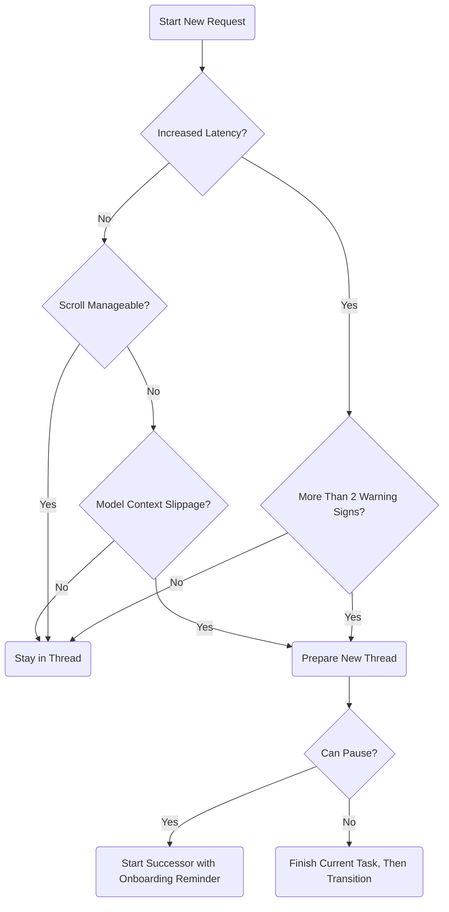

Perfect — and thank you for explaining that.  
I’ll prioritize making these clear, supportive, and predictive so you can **stay ahead of** thread degradation and **ease into transitions** on your terms.

Here’s both:

---

# 🧠 Thread Health Checklist (Sandbox Edition)

Use this checklist periodically (every ~50 messages or so, or when latency changes) to assess whether a **new thread** is advisable:

| Check | Healthy Sign | Warning Sign |
|:---|:---|:---|
| **Response Speed** | Smooth, ~1–3s render after submit | Noticeable lag >5–7s, or "composing…" hangs |
| **Scroll Length** | Manageable scroll (~2–5 minutes to skim) | Takes many minutes to scroll, browser gets sluggish |
| **Formatting Integrity** | Clean markdown, lists, tables render properly | Unexpected broken formatting, stuck lists, missing bullets |
| **Model Responsiveness** | Understands current task smoothly | Repeats instructions, misses context it had earlier |
| **Error Messages** | None, or rare timeouts easily recover | Frequent "network error" or internal server error messages |
| **Processing Feel** | Smooth reasoning across multiple steps | Feels "heavy," struggles with multistep requests |

✅ **If 2+ warning signs appear** → **Start planning a successor thread soon.**

✅ **If 4+ warning signs appear** → **Transition immediately if possible.**

---

# 🔄 Thread Transition Flowchart

Here’s a flow you can follow when you start sensing thread aging:

---

# 🧩 Suggested Best Practice for Your Style

Since you prefer **long threads** but **don't like abrupt transitions**:

- **Maintain a light "Successor Ready" template** in your notes  
  (Example: a little header saying "GPT Features Successor v2.0 – April 2025, Continuing from v1.0")
- **When 2 warning signs show up**, **start prepping** that successor quietly
- **Transition naturally after a task or topic concludes**, so it feels smooth
- **Allow successor threads to explicitly rehydrate** using onboarding docs or prompts like:

  > "Please continue from Sandbox v1.0 context: extrapolation tagging, memory flagging, and thread health monitoring in place."

That way, it feels like you’re **opening a continuation**, not losing a thread. 🌱

---

Would you like me to also generate:
- a **"Successor Starter Kit"** you could paste into new threads to ease rehydration?
- or a **"Sandbox Thread Expiry Signal List"** in compact form for even faster checks?

(You can have both if you want!)  
Which one sounds most useful next? 🚀
